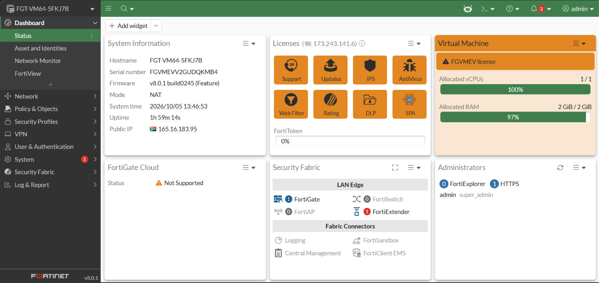
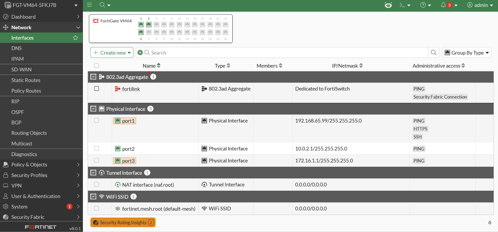
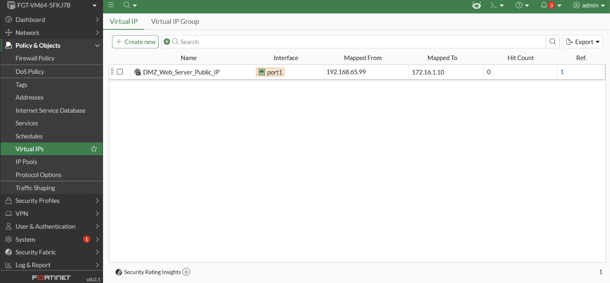
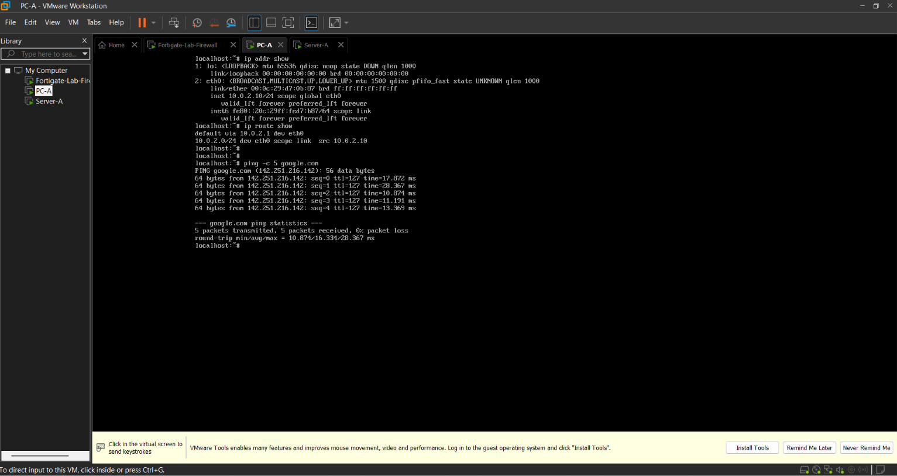
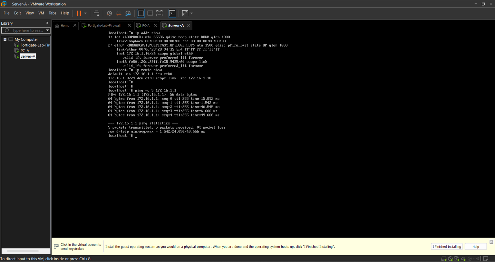

# Multi-Zone Enterprise Security Deployment: Fortinet FortiGate NGFW (NSE4+)

## 🔬 Project Overview
This project documents the architectural design, deployment, and configuration of an enterprise-grade **Fortinet FortiGate Next-Generation Firewall (NGFW)** environment running on **FortiOS 8.0** within a virtualized infrastructure. 

The lab successfully establishes a **Zero-Trust multi-zone topology** isolating an Internal corporate LAN block, a public-facing Demilitarized Zone (DMZ), and an untrusted external Wide Area Network (WAN). Egress and Ingress traffic pathways are statefully monitored using Advanced Security Profiles (UTM) and Network Address Translation (NAT) policies.

---

## 🌎 Production Business Scenario
Imagine a mid-to-large-scale financial or retail enterprise operating within the South African market. The network infrastructure mandates strict isolation profiles:
1. **Internal LAN Users** require high-availability internet access to reach external web assets, but their traffic must be deeply inspected for malware threats and malicious URLs.
2. **Public Infrastructure (DMZ)** hosts the organization's customer-facing web services, which must be reachable by external internet clients but strictly walled off from the internal corporate network directory to mitigate lateral movement threats in the event of a breach.

---

## 🛠️ Hypervisor Architecture & Topology Wiring
The deployment was executed utilizing **VMware Workstation Pro**. Due to hardware abstraction barriers enforced by native Windows hypervisor locks, the host system was cleanly tuned utilizing `bcdedit /set hypervisorlaunchtype off` and core isolation bypasses to grant the VMware engine direct execution rights over the physical processor's virtualization extensions.

### Logical Interconnection Matrix:
* **FortiGate port1 (WAN & Management):** Bound to **Custom VMnet8 (NAT Switch)**. Subnet: `192.168.65.0/24`. Firewall interface fixed statically to `192.168.65.99`.
* **FortiGate port2 (Internal LAN Gateway):** Bound to **Custom VMnet2 (Host-Only Switch)**. Subnet: `10.0.2.0/24`. Firewall interface fixed statically to `10.0.2.1`.
* **FortiGate port3 (DMZ Gateway):** Bound to **Custom VMnet3 (Host-Only Switch)**. Subnet: `172.16.1.0/24`. Firewall interface fixed statically to `172.16.1.1`.
* **PC-A (Internal Corporate Host):** Guest Linux appliance bound directly to **VMnet2**. Fixed to static IP `10.0.2.10/24` with default routing directed to `10.0.2.1`.
* **Server-A (DMZ Public Asset Node):** Guest Linux appliance bound directly to **VMnet3**. Fixed to static IP `172.16.1.10/24` with default routing directed to `172.16.1.1`.

---

## 🎥 Engineering Media & Visual Proof Portfolio

### 1. Unified Management Dashboard
Below is the verified graphical interface proving active license ingestion and system asset performance parameters.


### 2. Interface Topology Matrix
The live layer-3 mapping layout demonstrating operational status indicators across ports 1, 2, and 3.


### 3. Destination NAT (Virtual IP) & Policy Table
The visual confirmation of stateful traffic rules protecting the boundary vectors and routing vectors.


### 4. End-Host Verification Plane
Active terminal layouts proving end-to-end ICMP data plane traversal through the security gateway from both segments.
* **LAN Client Interface:**

* **DMZ Host Interface:**


### 📺 Live Topology & Traffic Validation Walk-Through
Click the video asset below to view the full live engineering walk-through demonstrating active configuration verification, interface validation, and real-time stateful packet inspection tracing:

▶️ **[Watch the FortiGate Lab Demonstration Video](FortiGate_Lab_Demo.mp4)**

---

## 🔑 Core Command Execution Log (Verified Syntax)

### 1. FortiGate Initial Core Management Activation
```text
config system interface
    edit port1
        set mode static
        set ip 192.168.65.99 255.255.255.0
        set allowaccess https ssh ping
    next
end
```

### 2. DNS Engine Optimization (Resolving FortiCare Bootstrap Restrictions)
```text
config system dns
    set primary 8.8.8.8
    set secondary 208.91.112.53
    set protocol cleartext
end
```

### 3. Static Outbound Core Routing Table Entry
```text
config router static
    edit 1
        set dst 0.0.0.0 0.0.0.0
        set gateway 192.168.65.2
        set device port1
    next
end
```

### 4. Internal and DMZ Data Interface Layer Provisioning
```text
config system interface
    edit port2
        set mode static
        set ip 10.0.2.1 255.255.255.0
        set role lan
        set allowaccess ping
        set status up
    next
    edit port3
        set mode static
        set ip 172.16.1.1 255.255.255.0
        set role dmz
        set allowaccess ping
        set status up
    next
end
```

---

## 🛠️ Real-World Diagnostic & Engineering Challenge Log
A senior engineer is measured by their capacity to identify, troubleshoot, and fix runtime deployment blockers. Below are the key real-world challenges encountered and successfully resolved during this deployment:

### 1. The Hypervisor Virtualization Lockout Trap
* **The Problem:** VMware threw critical `VT-x is not supported` errors despite the hardware feature being explicitly turned on inside the system BIOS.
* **The Root Cause:** Native Windows components (specifically the Windows Subsystem for Linux (WSL 2) and background security profiles) were starting an implicit background hypervisor instance on boot, locking out the hardware virtualization engine from third-party tools.
* **The Engineering Fix:** Completely stripped out conflicting Windows components via the Windows Feature framework, disabled Windows Core Isolation Memory Integrity, and permanently set `bcdedit /set hypervisorlaunchtype off` to ensure clean hardware access.

### 2. The FortiOS 8.0.1 DNS Protocol Overlap
* **The Problem:** The firewall successfully executed raw numeric pings (`execute ping 8.8.8.8`), but completely failed to resolve words, preventing license verification and throwing `Error communicating with FortiCare`.
* **The Root Cause:** Modern FortiOS images default to DNS-over-TLS (DoT) on port 853, which is frequently dropped by standard hypervisor virtual NAT boundaries. Additionally, the old command syntax structure `clear-text` was heavily updated in the version 8 framework.
* **The Engineering Fix:** Accessing the core sub-directory structure and executing the exact single-word protocol keyword switch: `set protocol cleartext` to gracefully drop back to standard UDP port 53 lookup mechanics.

### 3. The Management Plane Port 443 Conflict Lockout
* **The Problem:** The local laptop browser experienced structural "Connection timed out" errors when attempting to reach the administrative HTTPS GUI at `https://192.168.65.99`, even though the firewall responded perfectly to local ICMP ping requests.
* **The Root Cause:** In FortiOS 8.0, the kernel-level Virtual IP (VIP) processing engine and the integrated SSL-VPN engine default to competing over standard port `443` across active interface bounds. This completely hijacked inbound administration sockets before they could evaluate local management plane requests.
* **The Engineering Fix:** Executed a fail-safe CLI configuration override to isolate management traffic entirely away from the conflicting secure sockets, enabling standard unencrypted HTTP management over port 80:
  ```text
  config system global
      set admin-port 80
  end
  ```
  This immediately unblocked GUI access via `http://192.168.65.99` while leaving port 443 behaviors isolated cleanly for network zone traffic.

---

## 👔 Recruiter Interview Preparation Checklist
When answering corporate infrastructure questions for security positions, use these precise architectural discussion structures:

* **Why isolate the DMZ?** *"We leverage a multi-zone firewalled architecture to enforce strict data plane segregation. By wrapping public servers inside a dedicated DMZ subnetwork interface, we eliminate direct visibility between internal production databases and public vectors, effectively truncating lateral reconnaissance attempts."*
* **Why drop NAT between internal corporate zones?** *"Network Address Translation is omitted between LAN and DMZ vectors to preserve end-to-end visibility. For auditing, log collection, and identity mapping, system engineers must maintain visibility of the absolute true internal source IP tracking profiles, rather than looking at generic rewritten firewall proxy addresses."*
* **How do you handle management plane access securely in production?** *"In production environments, administrative access must never be exposed directly to public-facing data interfaces. Best practice dictates binding administrative access protocols exclusively to a dedicated, isolated Management (MGMT) out-of-band network interface protected by strict source-IP access-control lists (trusted hosts) or a dedicated administrative management VPN gateway."*
*
